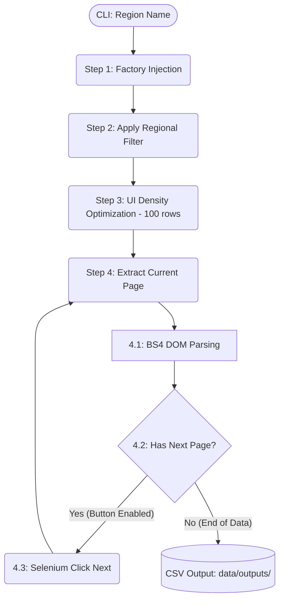

# 📈 Yahoo Finance Regional Crawler

**Yahoo Finance Regional Crawler** is a high-performance, automated data extraction tool designed to collect equity information across different global markets.

It utilizes a hybrid architecture combining **Selenium** for dynamic browser orchestration and **BeautifulSoup (BS4)** for rapid DOM parsing. The system is built to navigate through complex regional filters, handle infinite pagination, and produce clean, timestamped datasets for financial analysis.

---

## 📦 Project Overview

This project automates the manual task of filtering and exporting stock screeners from Yahoo Finance.

The main goal is to **scrape ticker symbols, company names, and intraday prices** based on a user-defined geographical region. The crawler handles the selection of filters, sets the view to maximum density (100 rows), and iterates through all available pages until the entire regional portfolio is captured.

The core of the logic lives inside the `src/` directory:

```bash
.
├── run.py                 # Entry Point (CLI Wrapper)
├── Dockerfile             # Multi-stage Build (Test & Runtime)
├── docker-compose.yml     # Orchestration & Volume Mapping
└── src/
    ├── app/
    │   ├── main.py        # Application Orchestrator
    │   └── factories.py   # WebDriver Dependency Injection
    │
    ├── config/
    │   └── config.py      # Global Settings & Selenium Options
    │
    └── services/
        └── yahoo_finance_service.py # Core Scraper Logic (Selenium + BS4)
```

---

## ⚙️ General Flow (Architecture)

All execution starts at `run.py`, which captures the CLI argument and passes it to the orchestrator.



Each module follows **Object-Oriented Programming (OOP)** principles, ensuring that browser interactions are decoupled from data parsing logic.

---

## 🧩 Modules Explained

#### 1. **YahooFinanceService** (Core Scraper) `src/services/yahoo_finance_service.py`

**Purpose:** Orchestrates the browser and parses the HTML. It uses a  **Hybrid Extraction Strategy** .

* **Hybrid Parsing:** Instead of using Selenium to find every single cell (slow), it captures the `page_source` and uses **BeautifulSoup** to extract data in memory (fast).
* **Data Sanitization:** Cleans tickers by removing leading decorative characters and handles missing names by extracting `aria-label` attributes from parent anchors.

---

#### 2. **factories.py** (Environment-Aware Injection) `src/app/factories.py`

**Purpose:** Decouples the service from the WebDriver creation. It detects if the app is running in **Docker** (using system Chromium) or **Local** (using `webdriver-manager`).

---

#### 3. **config.py** (The Brain) `src/config/config.py`

**Purpose:** Centralizes all Chrome Options (User-Agent, Headless mode, Anti-bot bypasses).

---

#### 4. **main.py** (Orchestrator) `src/app/main.py`

**Purpose:** Manages the lifecycle of the service and ensures resources are released.

**Workflow:**

1. Initializes the Service via the Factory.
2. Triggers the data fetching process.
3. **Graceful Cleanup:** Ensures `driver.quit()` is called even if the scraping fails, preventing memory leaks or ghost browser processes.

---

## 🚀 How to Run

You can run this project using [uv](https://github.com/astral-sh/uv), standard  **pip** , or  **Docker** .

### **Option A: Using uv (Recommended)**

```bash
# Sync environment and install dependencies
uv sync

# Run the crawler
uv run run.py "Argentina"
```

### **Option B: Using standard Python & pip**

```bash
# Create and activate virtual environment
python -m venv .venv
source .venv/bin/activate  # Linux/Mac
# .venv\Scripts\activate   # Windows

# Install dependencies and run
pip install -r requirements.txt
python run.py "Argentina"
```

### **Option C: Using Docker (Containerized)**

This is the most reliable way to run the crawler, as it packages the correct versions of Chromium and Drivers, running in **Headless** mode.

```bash
# Build the image (it will automatically run pytest)
docker-compose build

# Run the crawler for Argentina (default in compose file)
docker-compose up

# Run for a different region via CLI
docker-compose run yahoo-crawler "United States"
```

---

## 📊 Data Outputs

Regardless of the method chosen, all results are saved in the `data/outputs/` directory.

* **Format:** `region_YYYYMMDD_HHMMSS.csv`
* **Fields:** `symbol`, `name`, `price`
* **Docker Persistence:** When using Docker, the `data/outputs` folder is mapped to your local machine via volumes, so the CSV files will appear in your local project folder immediately.

---

## 🧪 Testing

The project includes unit tests with **Mocks** to validate parsing logic without requiring a live browser connection.

```bash
# Run tests
uv run pytest tests/
```

---

## 🧭 Project Requirements Checklist

| **Requirement**      | **Implementation Status**        |
| -------------------------- | -------------------------------------- |
| **Language**         | Python 3.11                            |
| **Browser Engine**   | Selenium (Headless Support)            |
| **DOM Parsing**      | BeautifulSoup4 (BS4)                   |
| **Paradigm**         | Object-Oriented Programming (OOP)      |
| **Output**           | Timestamped CSV in `data/outputs/`   |
| **Unit Tests**       | Implemented via Pytest & Unittest.mock |
| **Containerization** | Docker & Docker Compose Support        |

---

## 🧭 Where to Change Business Rules?

| **If you want to change...**        | **Go to file...**                                        |
| ----------------------------------------- | -------------------------------------------------------------- |
| **Chrome Options (Headless, etc.)** | `src/app/config.py`                                       |
| **CSV Storage Path**                | `src/services/yahoo_finance_service.py` (`_export_to_csv`) |
| **Implicit/Explicit Waits**         | `src/services/yahoo_finance_service.py` (`__init__`)       |
| **Table Column Mapping**            | `src/services/yahoo_finance_service.py` (`_extract_table`) |
